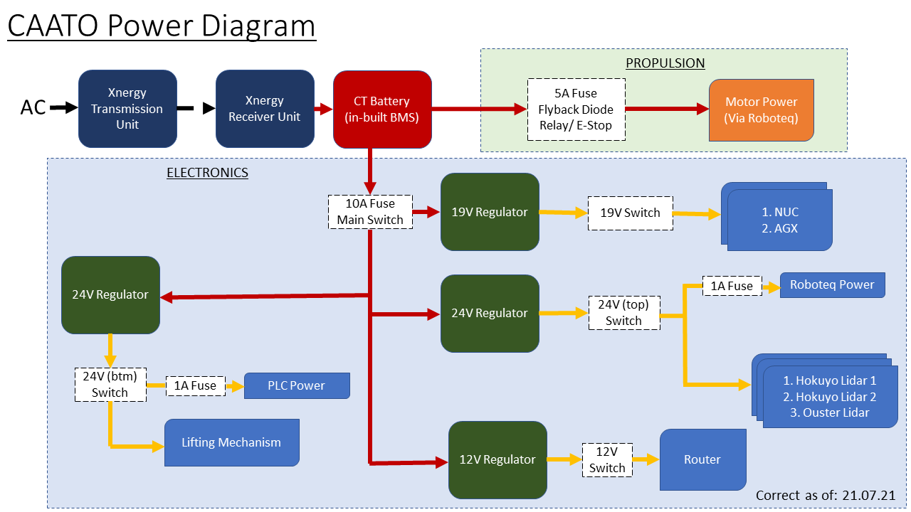
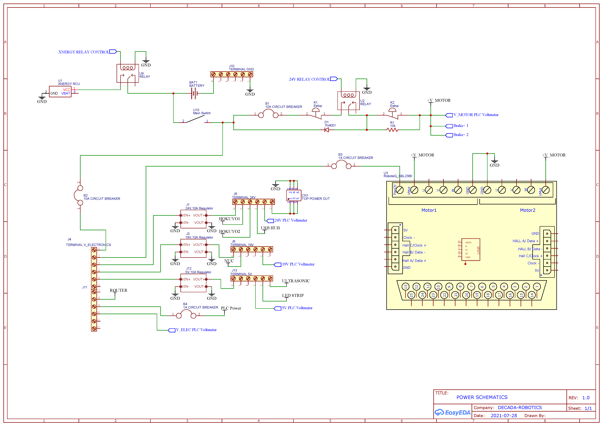

# Power Diagram and Schematics

double check add in extra stuff

CAATO is powered by two 24V batteries (28.4V at full charge) in parallel, connected to a Xnergy receiver unit for wireless charging. The power is separated into two distinctions, propulsion and electronics.

The propulsion line provides power to the drive motor through the RoboteQ SBL3260T module, and is protected by a dedicated fuse, fly-back diode and various switches.

To cater to the different electronics, three voltage buses are provided by different DC-DC regulators (12V, 19V and 24V). The electronics line is protected by a single 10A fuse and placed in series with a switch, before being regulated at the various voltages. Each voltage bus is also connected to a switch then to individual terminal blocks for greater control and safety over the components.

CAATO Power Schemetic

[Schematic_CAATO PLC.pdf](./pdf/Schematic.pdf)