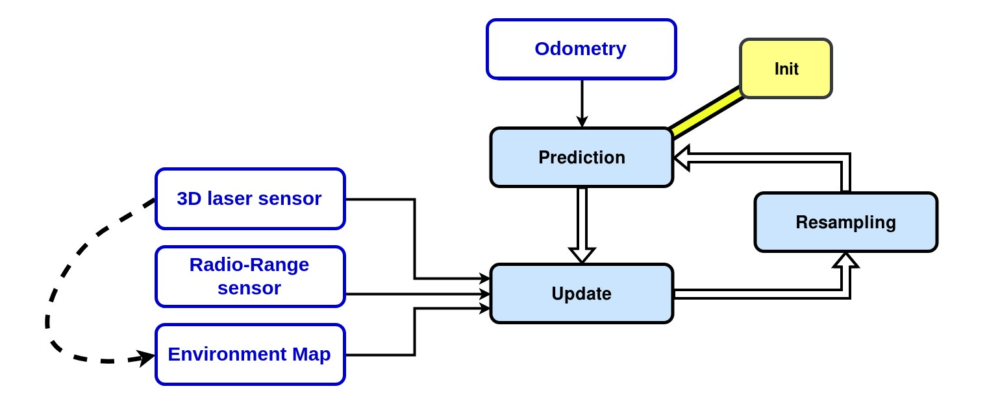

# Software

## General Operability & Overview

- For Caato2 to carry out its tasks using ROS, certain commands are needed to be executed
- Various packages are available to be implemented onto Caato2
    - Git Clone from
        
        [GitHub - TRL-RMF/caato2: Robot files for CAATO2.](https://github.com/TRL-RMF/caato2)
        

## Packages and Launch Files

1. Caato2_bringup
    - Launches certain relevant nodes which are needed for basic operation and functionality
        - Roboteq Differential Driver - Control the motors
        - Lasers - Activates the lasers used by Caato2
        - Teleop - Enable manual control of Caato2
        - DS4 Driver - Enable control of Caato2 using a remote joystick
2. Caato2_navigation
    - Launches relevant stacks needed for navigation
        - EBAND (Preferred)
        - DWA
        - TEB
3. Cartographer (2D & 3D)
    - Cartographer is a system that provides real-time simultaneous localization and mapping (SLAM) in 2D and 3D across multiple platforms and sensor configurations.
    - For detailed tutorials on Cartographer implementation with ROS please go to the following link.
    
    [Cartographer ROS Integration - Cartographer ROS documentation](https://google-cartographer-ros.readthedocs.io/)
    
4. AMCL3D
    - **Adaptive Monte-Carlo Localization in 3D** is a particle filter that allows you to estimate where a robot is within a 3D environment without using GPS, for example in indoor environments.
    - The algorithm uses radio-range sensors, laser sensors, and a known map of the environment for calculating the particles weights. The algorithm takes as inputs an odometry, point-clouds that the robot sees and the distances between range sensors that are in the environment. It compares the map point-cloud with the robot point-clouds and takes into account the radio-range measurements to calculate the probability that the robot is in a bounded environment. In such environment, the particles have different weights according to each computed probability. The weighted average of all the particles would give the result of the robot pose (position and orientation).
    
    
    

1. Octomap
    
    
2. Xnergy charger
    - roslaunch xnergy_charger_rcu xnergy_charger_modbus.launch
        - Launches the modbus communication between the charger and the RCU
    - rosservice call /xnergy_charger_rcu/start_charging
        - Initiates the charging process

## RViz

- RViz is a 3D visualization software tool for robots, sensors, and algorithms. It enables you to see the robot’s perception of its world (real or simulated). The purpose of RViz is to enable you to visualize the state of a robot. It uses sensor data to try to create an accurate depiction of what is going on in the robot’s environment

## Gazebo

- Gazebo is a 3D robot simulator. Its objective is to simulate a robot, giving you a close substitute to how your robot would behave in a real-world physical environment. It can compute the impact of forces (such as gravity)