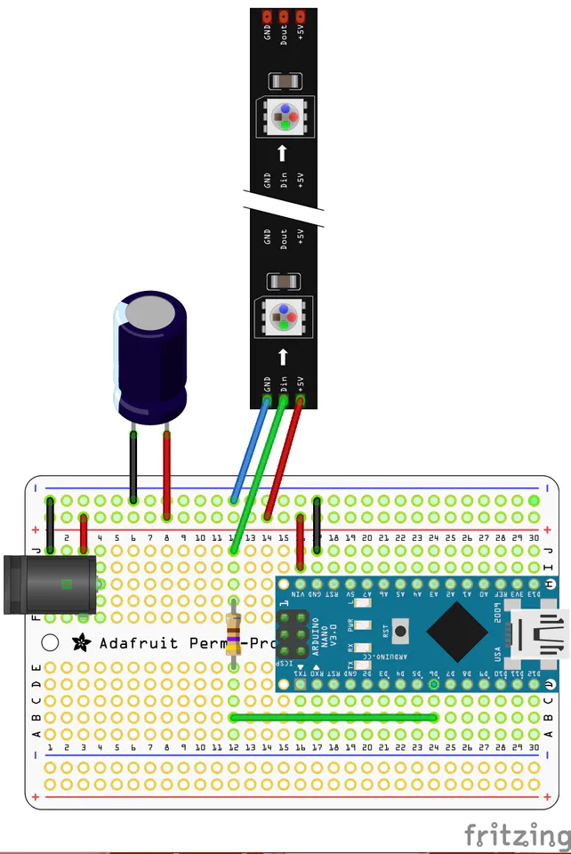

# LED Strip

The circuit is set up as shown in the diagram below, with a 330Ω resistor to reduce data reflections and a 470µF capacitor to reduce voltage spikes on startup and shutdown.

Available commands:

“`RED.`”, “`BLUE.`”, “`GREEN.`”, “`WHITE.`”, “`PURPLE.`”, “`OFF.`”.

Attached is the updated code, `LED_control_100821.ino`

[LED_control_100821.ino](./code/LED_control_100821.ino)